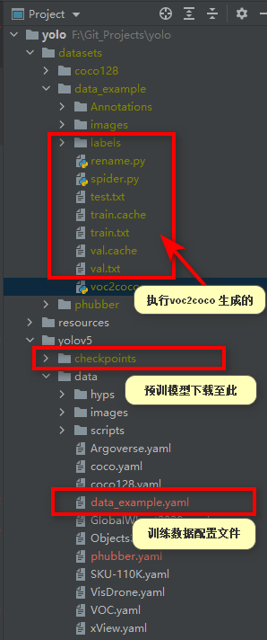

# yolov5 使用笔记

## 1. 环境及仓库准备
从零开始
```shell
# 创建项目根目录
mkdir yolo
cd yolo

# 创建环境（yolov5，环境名称可自行设置）
conda create -n yolov5 python=3.8
conda activate yolov5
# or 使用pycharm 面板创建

# 克隆 yolov5 官方仓库
git clone https://github.com/ultralytics/yolov5  # clone
cd yolov5
pip install -r requirements.txt  # install （确保是安装在刚创建的环境里面）
```

or 直接拉取本仓库代码
```shell
git clone https://github.com/Coshpr/yolo.git
cd yolo
conda create -n yolov5 python=3.8
conda activate yolov5
cd yolov5
pip install -r requirements.txt  # install （确保是安装在刚创建的环境里面）
```


## 2. 准备数据
> 官方参考自定义数据：[wiki：Train-Custom-Data](https://github.com/ultralytics/yolov5/wiki/Train-Custom-Data)

#### 2.1 下载预训练模型
下载预训练模型作为模型的初始化，下载保存至：`/yolo/yolov5/checkpoints/`
> ！ 文件夹 `yolov5` 下面没有 `checkpoints` 目录，需要自行创建。

根据模型的尺寸和深度不同，分为：yolov5s yolov5m yolov5l …… 。所有预训练好的模型，可在 [releases](https://github.com/ultralytics/yolov5/releases#:~:text=60%20other%20contributors-,Assets,-17) 内查看并下载，

```shell
# 友情下载链接
https://github.com/ultralytics/yolov5/releases/download/v6.1/yolov5s.pt
https://github.com/ultralytics/yolov5/releases/download/v6.1/yolov5m.pt
https://github.com/ultralytics/yolov5/releases/download/v6.1/yolov5l.pt
```


#### 2.1 自定训练数据
参考 coco128格式，自定义数据集保存至： `/yolo/datasets/your_dataset/`， 我在仓库里提供了样例 `/yolo/datasets/data_example/`, 需要执行 `voc2coco.py` 进行数据转换
```
# coco128数据下载地址
https://www.kaggle.com/ultralytics/coco128

# yolo
# ├── yolov5
# └── datasets
#     └── coco128
```

标注格式规范，请查看：
```shell
https://github.com/ultralytics/yolov5/wiki/Train-Custom-Data#11-create-datasetyaml
# 每个对象是一行
# 每一行都是 x_center y_center width height 格式. 
# 框坐标必须采用标准化 xywh 格式（从 0 到 1）。如果您的框以像素为单位，则将 x_center 和 width 除以图像宽度，将 y_center 和 height 除以图像高度。
# 类号是零索引的（从 0 开始）

# example： **.txt
45 0.479492 0.688771 0.955609 0.5955
45 0.736516 0.247188 0.498875 0.476417
50 0.637063 0.732938 0.494125 0.510583
```

文件夹截图所示：
<div style="text-align: center;">



</div>


预训练模型训练细节，[点击查看](https://wandb.ai/glenn-jocher/YOLOv5_v61_official) ，如不能访问需要科学上网。

## 训练
自己使用 `labelme` 或 `lableImg` 标注的数据，需要进行转换。

例如: 脚本 `your_path/yolo/datasets/data_example/voc2coco.py`,将 VOC 格式转换成 yolov5 所要求的格式。

### 数据配置文件
> 撰写`数据配置文件`，放在 `/yolo/yolov5/data/`

例如：yolo/yolov5/data/data_example.yaml
```shell 
# -*- coding: utf-8 -*-

path: ../datasets/data_example # dataset root dir

train: train.txt
val: val.txt

#number of classes
nc: 4

#class names
names: ['phone','person','pad','book']  
```

训练脚本：
```shell
# cd */yolo/yolov5
python train.py --cfg ./models/yolov5s.yaml --data ./data/data_example.yaml --weights ./checkpoints/yolov5s.pt --img 640 --epochs 10

```
`--cfg` 模型配置

`--data` 你定义的数据的`yaml`配置文件

`--weights` 预训练好的模型

`--epochs` 训练轮次

更多配置请看 `train.py`