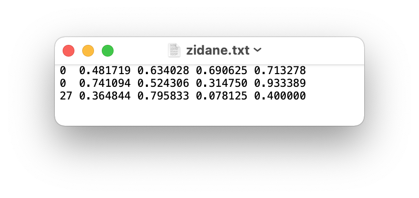

# yolo
目标检测相关，yolo系列


## 自定义数据集
> [参考：wiki Train-Custom-Data](https://github.com/ultralytics/yolov5/wiki/Train-Custom-Data)

### 1.1 Create dataset.yaml
COCO128 is an example small tutorial dataset composed of the first 128 images in COCO train2017. These same 128 images are used for both training and validation to verify our training pipeline is capable of overfitting. data/coco128.yaml, shown below, is the dataset config file that defines 1) the dataset root directory path and relative paths to train / val / test image directories (or *.txt files with image paths), 2) the number of classes nc and 3) a list of class names:

```shell
# Train/val/test sets as 1) dir: path/to/imgs, 2) file: path/to/imgs.txt, or 3) list: [path/to/imgs1, path/to/imgs2, ..]
path: ../datasets/coco128  # dataset root dir
train: images/train2017  # train images (relative to 'path') 128 images
val: images/train2017  # val images (relative to 'path') 128 images
test:  # test images (optional)

# Classes
nc: 80  # number of classes
names: [ 'person', 'bicycle', 'car', 'motorcycle', 'airplane', 'bus', 'train', 'truck', 'boat', 'traffic light',
         'fire hydrant', 'stop sign', 'parking meter', 'bench', 'bird', 'cat', 'dog', 'horse', 'sheep', 'cow',
         'elephant', 'bear', 'zebra', 'giraffe', 'backpack', 'umbrella', 'handbag', 'tie', 'suitcase', 'frisbee',
         'skis', 'snowboard', 'sports ball', 'kite', 'baseball bat', 'baseball glove', 'skateboard', 'surfboard',
         'tennis racket', 'bottle', 'wine glass', 'cup', 'fork', 'knife', 'spoon', 'bowl', 'banana', 'apple',
         'sandwich', 'orange', 'broccoli', 'carrot', 'hot dog', 'pizza', 'donut', 'cake', 'chair', 'couch',
         'potted plant', 'bed', 'dining table', 'toilet', 'tv', 'laptop', 'mouse', 'remote', 'keyboard', 'cell phone',
         'microwave', 'oven', 'toaster', 'sink', 'refrigerator', 'book', 'clock', 'vase', 'scissors', 'teddy bear',
         'hair drier', 'toothbrush' ]  # class names

```

### 1.2 Create Labels
After using a tool like Roboflow Annotate to label your images, export your labels to YOLO format, with one *.txt file per image (if no objects in image, no *.txt file is required). The *.txt file specifications are:

+ One row per object
+ Each row is class `x_center y_center ` width height format.
+ Box coordinates must be in `normalized` xywh format (from 0 - 1). If your boxes are in pixels, divide `x_center` and `width` by image width, and `y_center` and height by image height.
+ Class numbers are `zero-indexed` (start from 0).


The label file corresponding to the above image contains 2 persons (class `0`) and a tie (class `27`):




### 1.3 Organize Directories
Organize your train and val images and labels according to the example below. YOLOv5 assumes /coco128 is inside a /datasets directory next to the /yolov5 directory. YOLOv5 locates labels automatically for each image by replacing the last instance of /images/ in each image path with /labels/. For example:

```shell
../datasets/coco128/images/im0.jpg  # image
../datasets/coco128/labels/im0.txt  # label
```


